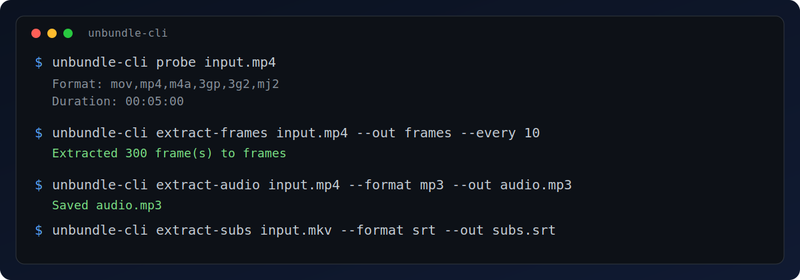
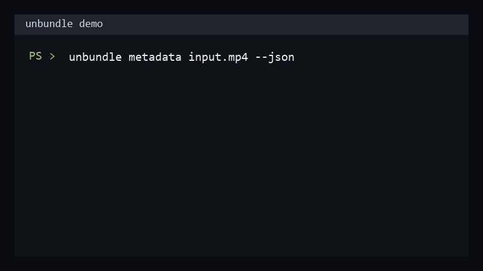

# unbundle

[](https://crates.io/crates/unbundle)
[](https://crates.io/crates/unbundle)
[](https://docs.rs/unbundle)
[](https://github.com/skanderjeddi/unbundle/actions/workflows/ci.yml)
[](https://www.rust-lang.org/)
[](https://github.com/skanderjeddi/unbundle/releases)
[](LICENSE)
[](https://github.com/skanderjeddi/unbundle)

**The ergonomic Rust media toolkit** — extract frames, audio, and subtitles with clean APIs and real FFmpeg power.

<p align="center">
  
</p>

## Build media features faster

`unbundle` gives you a high-level, type-safe interface over FFmpeg so you can ship video/audio workflows without fighting low-level decode details.

### What you can build

- Thumbnail services & contact sheets
- Media ingestion & processing pipelines
- Validation & metadata tools
- Analysis tools (keyframes, scene detection, VFR)
- Async batch processors

### Why developers choose unbundle

- **Ergonomic API** — `DynamicImage` frames, structured subtitles, zero boilerplate
- **Production controls** — progress, cancellation, stream copy, validation
- **Flexible outputs** — files, memory, iterators, async streams
- **Single toolkit** — extraction + probing + remuxing + analysis in one crate

## Quick start

### Install

**Library**
```toml
[dependencies]
unbundle = "5"          # or { version = "5", features = ["full"] }
```

**CLI**
```bash
cargo install unbundle
```

### Hello media

```rust
use std::time::Duration;
use unbundle::{AudioFormat, MediaFile};

let mut media = MediaFile::open("input.mp4")?;

// Frame at 10s
media.video().frame_at(Duration::from_secs(10))?.save("frame_10s.png")?;

// Full audio track
media.audio().save("audio.wav", AudioFormat::Wav)?;
```

## CLI quick reference

<p align="center">
  
</p>

```bash
# Metadata
unbundle metadata input.mp4
unbundle info input.mp4

# Frames / audio / subtitles
unbundle extract-frames input.mp4 --out frames --every 12
unbundle extract-audio input.mp4 --format mp3 --out audio.mp3
unbundle extract-subs input.mkv --format srt --out subs.srt

# Utilities
unbundle validate input.mp4
unbundle thumbnail input.mp4 --out thumb.jpg --timestamp 00:00:10
unbundle remux input.mkv output.mp4
```

**Global flags** (work on every command):

```bash
--progress
--verbose
--overwrite
--log-level <quiet|info|debug|trace>
--pixel-format <rgb8|rgba8|gray8>
--threads <N>
--hardware <auto|cuda|vaapi|dxva2|d3d11va|videotoolbox|qsv>
```

Feature-gated commands (`scene-detect`, `waveform`, `loudness`) appear when built with the matching crate features.

## Detailed installation

### Library with optional features

```toml
[dependencies]
unbundle = { version = "5", features = ["async", "rayon", "hardware"] }
```

### System requirements

`unbundle` requires **FFmpeg 4.0+** development libraries.

**Linux (Debian/Ubuntu)**
```bash
sudo apt-get install libavcodec-dev libavformat-dev libavutil-dev \
  libswscale-dev libswresample-dev libavdevice-dev pkg-config
```

**macOS**
```bash
brew install ffmpeg pkg-config
```

**Windows (vcpkg)**
```powershell
git clone https://github.com/microsoft/vcpkg.git C:\vcpkg
C:\vcpkg\bootstrap-vcpkg.bat
vcpkg install ffmpeg:x64-windows

# Add to environment (restart terminal after)
setx VCPKG_ROOT "C:\vcpkg"
setx FFMPEG_DIR "C:\vcpkg\installed\x64-windows"
setx PATH "%PATH%;C:\vcpkg\installed\x64-windows\bin"
```

The crate’s `build.rs` will give helpful guidance if anything is missing.

## Core capabilities

- Frame extraction (single, ranges, intervals, timestamps, segmented)
- Audio extraction (full track or ranged, to file or memory)
- Subtitle extraction (text + bitmap)
- Lossless stream copy & remuxing
- Rich metadata, chapters, and file validation
- Thumbnail helpers (single, grid, smart variance-based)
- Analysis tools (keyframes/GOP, variable frame rate, packet iteration)

## Optional features

| Feature     | What it adds                          |
|-------------|---------------------------------------|
| `async`     | `FrameStream` + `AudioFuture` (Tokio) |
| `rayon`     | Parallel frame decoding               |
| `hardware`  | GPU decoding (CUDA, VAAPI, …)         |
| `scene`     | Scene change detection                |
| `gif`       | Animated GIF export                   |
| `waveform`  | Waveform visualization data           |
| `loudness`  | Peak/RMS loudness (dBFS)              |
| `transcode` | Audio re-encoding                     |
| `encode`    | Encode image sequences to video       |
| `full`      | Everything                            |

## More examples

All runnable with `cargo run --example <name>`:

```bash
cargo run --example metadata -- path/to/video.mp4
cargo run --example extract_frames -- path/to/video.mp4
cargo run --example thumbnail -- path/to/video.mp4
cargo run --example remux -- path/to/video.mp4
```

Full list in the [`examples/`](https://github.com/skanderjeddi/unbundle/tree/main/examples) directory.

## Testing & benchmarks

```bash
# Generate test fixtures
bash tests/fixtures/generate_fixtures.sh          # Linux/macOS
tests\fixtures\generate_fixtures.bat              # Windows

cargo test --all-features
cargo bench --all-features
```

## Troubleshooting

- **Linking errors** → Install FFmpeg dev libs and check `pkg-config --libs libavcodec`
- **Unsupported codec** → Run `ffmpeg -codecs` on your system
- **Hardware decode fails** → Use `--hardware auto` or `HardwareAccelerationMode::Auto`
- **High memory** → Use `for_each_frame`, `frame_iter`, or `AudioIterator` instead of collecting everything

## Project links

- **Docs** → https://docs.rs/unbundle
- **Repository** → https://github.com/skanderjeddi/unbundle
- **Changelog** → https://github.com/skanderjeddi/unbundle/releases
- **Contributing** → [CONTRIBUTING.md](CONTRIBUTING.md)

## License

MIT — see [LICENSE](LICENSE).